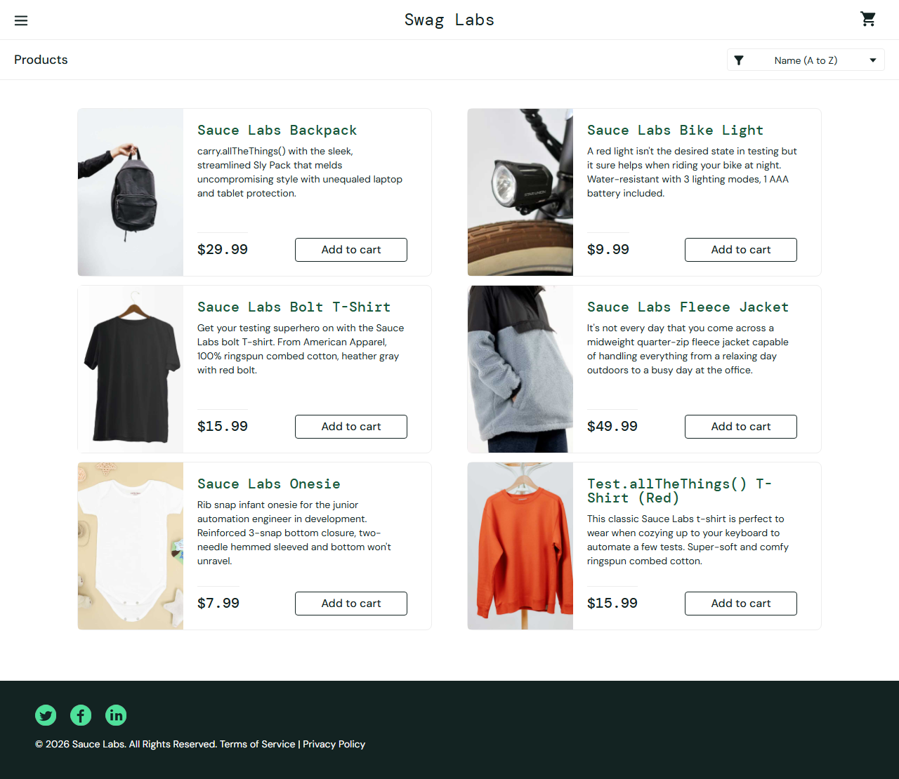

# SauceDemo QA Automation

[](https://github.com/himanshusharma-dev-2003/saucedemo-qa-automation/actions/workflows/playwright.yml)
[](https://himanshusharma-dev-2003.github.io/saucedemo-qa-automation/)

Hey there! 👋 Welcome to my automated end-to-end test suite for [SauceDemo](https://www.saucedemo.com). 

I built this project to showcase my approach to QA automation using modern tools. It's written in **TypeScript** using **Playwright**, and I designed it around the **Page Object Model (POM)** pattern to keep things clean and maintainable.

You can check out the **👉 [Live Test Report](https://himanshusharma-dev-2003.github.io/saucedemo-qa-automation/)** to see the results of the latest automated run! (It updates automatically every time code is pushed, thanks to GitHub Actions).

---

## 📸 A Quick Look
Here's a peek at the visual regression testing in action—this golden snapshot of the Inventory Page is automatically checked for pixel-perfect accuracy during every run:

<p align="center">
  
</p>

---

## 🧪 What I tested

I tried to cover a realistic mix of UI and API testing. Here's what's inside:

- **Login Flow (`tests/login.spec.ts`)**: Checks valid logins, locked-out accounts, empty fields, and unregistered users.
- **Data-Driven Login (`tests/login.data-driven.spec.ts`)**: Instead of writing the same test 10 times, I used a JSON file (`src/test-data/login-cases.json`) to loop through tricky edge cases like SQL injections, whitespace, and case sensitivity. 
- **Shopping Cart (`tests/inventory.spec.ts`)**: Makes sure products list correctly, sorting works (A-Z, High-Low), and the cart badge accurately tracks items.
- **Checkout (`tests/checkout.spec.ts`)**: Goes through the entire purchase flow, verifying required fields and checking that the math for the order total is actually correct. *Uses dynamic test data generated on the fly!*
- **Known Bugs (`tests/known-bugs.spec.ts`)**: SauceDemo has some intentional bugs for QA practice. I wrote automated tests that *expect* to fail, documenting the exact steps to reproduce them—just like a real bug ticket!
- **API Testing (`src/tests/api.spec.ts`)**: I added 6 tests hitting REST endpoints on JSONPlaceholder to validate GET, POST, filtering, 404 paths, and nested relational data. 
- **Database Validation (`src/tests/checkout-database-validation.spec.ts`)**: Validates that orders are correctly persisted to a MySQL database after checkout. Since SauceDemo doesn't have a real backend, this runs against a simulated mock database layer using the exact same interface a real database would use!
- **Visual Regression (`src/tests/visual.spec.ts`)**: Pixel-perfect snapshot testing of core pages.

---

## 🏗️ How I built it

I wanted this framework to reflect industry best practices:

- **Page Object Model (`/pages`)**: Selectors and actions live in one place. If a button's ID changes on the website, I only have to update it in one file, not 50 tests.
- **Environment Variables (`.env`)**: No hardcoded credentials here! Everything is driven by `dotenv` locally and GitHub Secrets in CI, making it super easy to swap between staging and production environments.
- **Custom Fixtures (`src/fixtures/index.ts`)**: I set up Playwright fixtures so that page objects and test data are automatically injected into every test, keeping the actual test files completely clutter-free.
- **Database Mocking (`src/utils/database.ts`)**: An `IDatabase` interface allows swapping seamlessly between a real `mysql2` connection and a `MockDatabase`. Driven by the `DB_HOST=mock` environment variable.
- **Dynamic Test Data (`src/utils/testDataGenerator.ts`)**: Integrated `@faker-js/faker` to generate random realistic users, addresses, and passwords on the fly. This prevents tests from hardcoding "John Doe" and ensures we test with a wide variety of string lengths and characters!
- **Negative Testing**: For every "happy path", I made sure to add tests for what happens when things go wrong (locked accounts, missing fields).
- **CI/CD Pipeline**: GitHub Actions is set up to run the full suite across Chromium, Firefox, WebKit, and Mobile Chrome emulation automatically on every push, and it even deploys the HTML report to GitHub Pages.

---

## 🚀 Want to run it yourself?

If you want to pull this down and run it on your own machine, it's super easy!

### 1. Install everything
```bash
npm install
npx playwright install --with-deps
```

### 2. Set up your environment
Copy the template file to create your local config:
```bash
cp .env.example .env
```
*(You don't even need to edit the `.env` file if you just want to test the default SauceDemo site!)*

### 3. Run the tests!
```bash
npm test                  # Run all tests across all browsers (headless)
npm run test:retry        # Retry only the tests that failed in the last run
npm run test:api          # Run just the API tests
npm run test:visual       # Run the visual regression tests
npm run test:headed       # Run UI tests visibly in the browser
npm run test:ui           # Open Playwright's amazing interactive UI mode
npm run report            # View the HTML report of your last run
```

---

## 🛠️ Tech Stack

- **[Playwright](https://playwright.dev/)** - E2E UI automation, API testing, and Visual Regression
- **TypeScript** - Strongly typed automation code
- **GitHub Actions & Pages** - CI/CD pipeline and hosted test reporting
